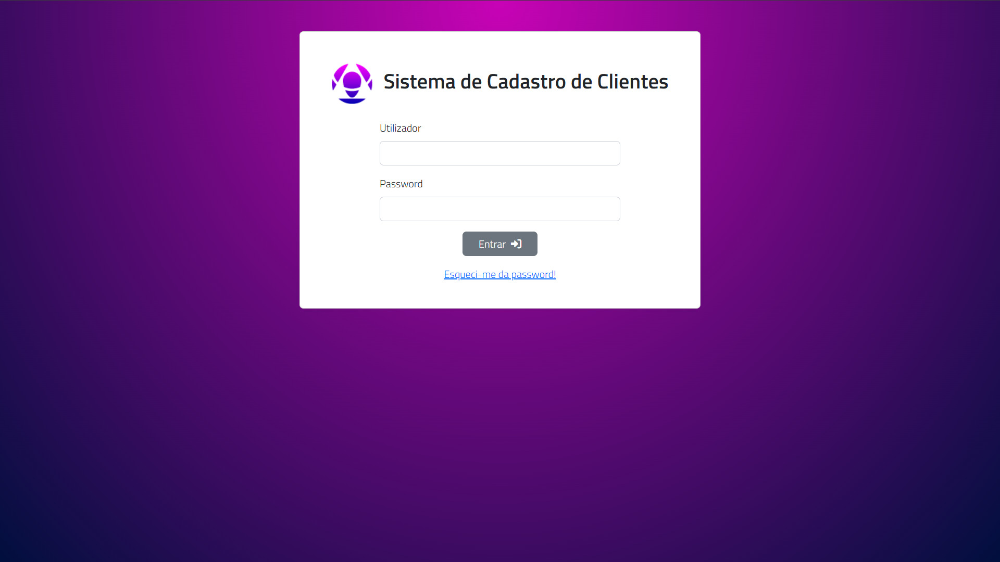
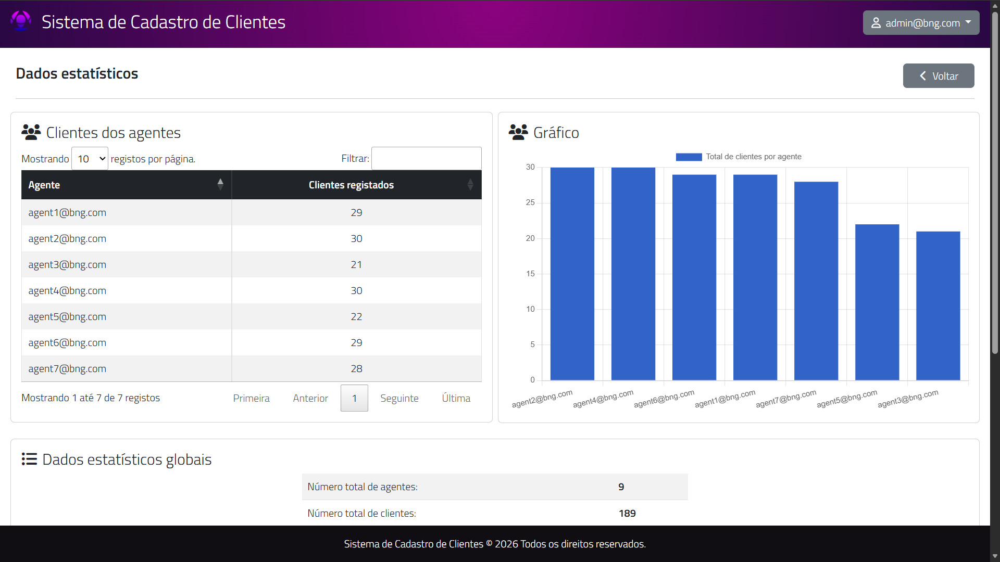
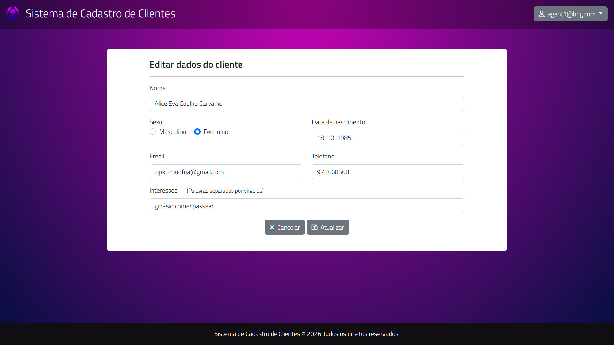
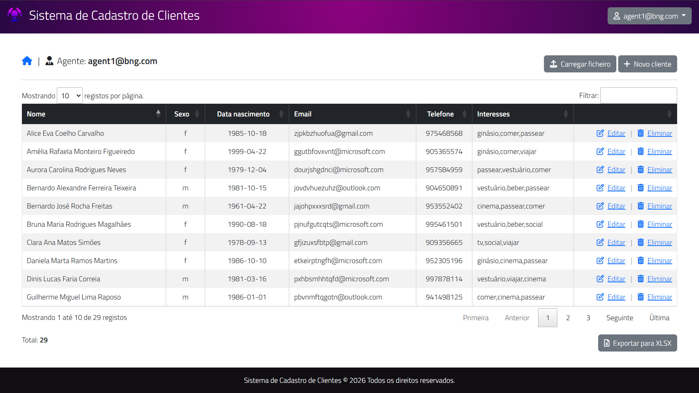
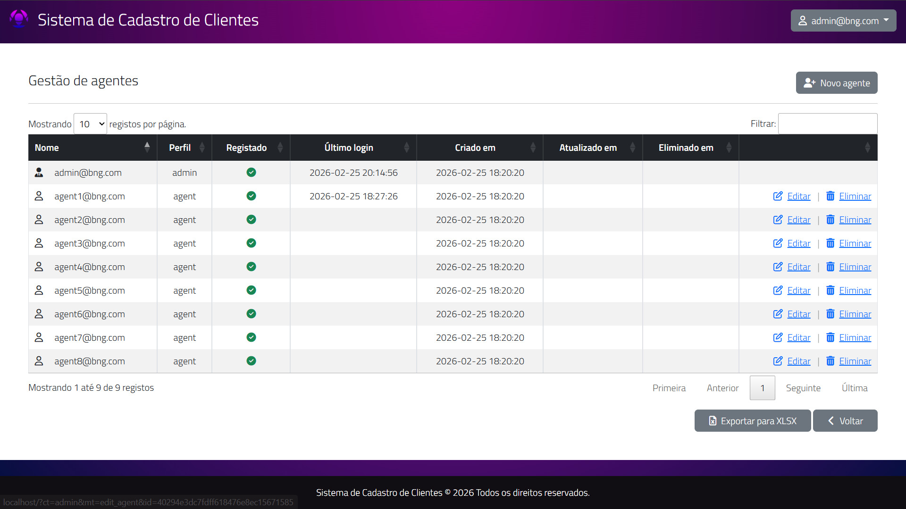

# Sistema de Cadastro de Clientes


Sistema web completo para gerenciamento de clientes e agentes, desenvolvido em PHP 8.2 com MySQL 8.0, totalmente containerizado com Docker.

Projeto focado em autenticação segura, criptografia de dados sensíveis, controle de acesso por perfil e geração de relatórios estatísticos.

---

# 📷 Screenshots

## 🔐 Tela de Login


## 📈 Estatísticas (Admin)


## 🤵 Edição de Clientes


## 👥 Lista de Clientes


## 📈 Gestão de agentes


---

# 🏗 Arquitetura

O projeto segue um padrão MVC simplificado:

- **Controllers** → Regras de negócio
- **Models** → Acesso ao banco de dados
- **Views** → Renderização das páginas
- **Router** → Controle de rotas
- **System Classes** → Database, Email, Helpers

Estrutura principal:

```
sistemadecadastrodeclientes/
├── app/
│   ├── controllers/
│   ├── models/
│   ├── views/
│   ├── helpers/
│   ├── system/
│   └── config.php
├── public/
│   ├── index.php
│   └── assets/
├── uploads/
├── logs/
├── vendor/
├── docker-compose.yml
├── Dockerfile
└── tabelas.sql
```

---

# 🛠️ Tecnologias Utilizadas

- **Backend**: PHP 8.2+
- **Banco de Dados**: MySQL 8.0+
- **Frontend**: HTML5, CSS3, Bootstrap 5
- **JavaScript**: jQuery, Chart.js, DataTables
- **Exportação**: PhpSpreadsheet (XLSX), mPDF (PDF)
- **Encriptação**: AES MySQL
- **Email**: PHPMailer

---

# 🚀 Executando o Projeto (100% Docker)

## 📦 Pré-requisitos

- Docker
- Docker Compose

---

## 1️⃣ Clone o repositório

```bash
git clone https://github.com/codorco/Sistema-de-cadastro-de-clientes.git
cd Sistema-de-cadastro-de-clientes
```

---

## 2️⃣ Suba os containers

```bash
docker-compose up -d --build
```

---

## 3️⃣ Instale as dependências (Composer)

```bash
docker exec -it web_server composer install
```

---

## 4️⃣ Importe o banco de dados

O container do MySQL já cria automaticamente o banco:

- Database: `db_bng`
- Usuário root
- Senha: `root`

Agora importe as tabelas:

```bash
docker exec -i banco_dados mysql -uroot -proot db_bng < tabelas.sql
```

---

## 📝 Configuração

Edite o arquivo `app/config.php` com suas configurações:

```php
// Banco de dados
define('MYSQL_HOST', 'localhost');
define('MYSQL_USER', 'usuario');
define('MYSQL_PASSWORD', 'senha');
define('MYSQL_DB', 'database');

// Email
define('MAIL_HOST', 'smtp.example.com');
define('MAIL_USER', 'email@example.com');
define('MAIL_PASSWORD', 'senha');

// Encriptação
define('MYSQL_AES_KEY', 'sua_chave_aes');
```
---

## 5️⃣ Acesse o sistema

Abra no navegador:

```
http://localhost
```

---

# 👥 Perfis de Usuário

## 🔹 Admin

- Gerenciamento completo de agentes
- Visualização global de clientes
- Estatísticas gerais
- Geração de relatórios PDF
- Exportação XLSX
- Edição e exclusão de agentes (soft delete)

## 🔹 Agent

- Cadastro de clientes próprios
- Edição e exclusão de clientes (Hard delete)
- Visualização de clientes vinculados
- Alteração de senha

---

# 🔐 Segurança

- Senhas com hash **bcrypt**
- Dados sensíveis criptografados com **AES**
- Soft Delete (não exclusão permanente)
- Logs de ações do sistema
- Validação de entrada em formulários
- Controle de acesso por perfil

---

# 📊 Funcionalidades Principais

- Adicionar e gerenciar clientes / agentes
- Autenticação com recuperação de senha via email
- Sistema de link único (PURL) para criação de senha
- Dashboard estatístico
- Relatórios em PDF
- Exportação de dados em XLSX
- Histórico de login de agentes
- Criptografia de nome, email e telefone
- Gráficos com Chart.js

---

# 🗄 Banco de Dados

- MySQL 8.0
- Criação automática do database via Docker
- Estrutura importada via `tabelas.sql`

---

# 🐳 Docker

O ambiente Docker contém:

## 🖥 App
- PHP 8.2
- Apache
- Extensões:
  - pdo
  - pdo_mysql
  - gd
  - intl
  - zip
- Composer instalado via multi-stage build
- mod_rewrite habilitado
- DocumentRoot configurado para `/public`

## 🗄 Banco
- MySQL 8.0
- Porta 3306 exposta
- Banco `db_bng` criado automaticamente

Containers criados:

- `web_server`
- `banco_dados`

---

# 📝 Logs

Arquivo:

```
logs/app.log
```

Registra:

- Logins
- Ações de criação/edição/exclusão
- Erros do sistema

---

# 📊 Relatórios

## Relatório PDF
Inclui:
- Listagem de agentes e total de clientes
- Estatísticas globais do sistema
- Data de geração do relatório
- Média de clientes por agente
- Média de idades dos clientes
- Idade do cliente mais novo e mais velho

## Exportação XLSX
Permite exportar para planilha:
- Lista completa de clientes
- Lista completa de agentes
- Dados em formato estruturado

---

# 🔧 Usuário Padrão (Ambiente de Desenvolvimento)

```
admin@bng.com
Senha: Aa123456
```

⚠ Recomenda-se alterar a senha após o primeiro login.

---

# 🐛 Tratamento de Erros

O sistema inclui:
- Validação de formulários
- Verificação de duplicação de dados
- Tratamento de erros de banco de dados
- Mensagens de erro/sucesso ao usuário
- Logs de erros para debugging

---

# 📄 Licença

MIT License.

---

# 👨‍💻 Autor

Codorco  
https://github.com/codorco

Projeto desenvolvido para fins de estudo e prática de arquitetura MVC, segurança e containerização com Docker.

Projeto feito com base no Curso: [Desenvolvimento Web Compacto e Completo - João Ribeiro  ](https://www.udemy.com/course/desenvolvimento-web-compacto-e-completo/)

---

# 📅 Última atualização

28 de Fevereiro de 2026